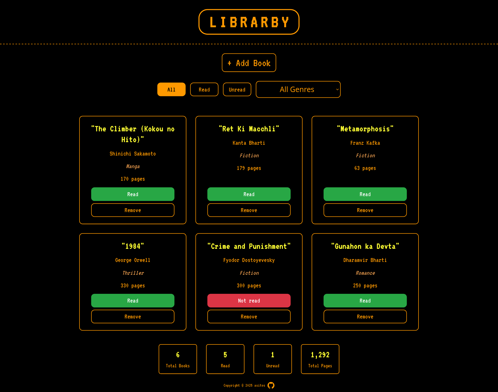

# L I B R A R B Y 

a library app, with a touch from **undertale**, a game i really like, powered by **localStorage**, so your books stay comfy and saved just for you. 

## live demo

- live at: https://asitos.github.io/library/

## screenshots


*Main interface showing the library with book cards and filtering options*


*Add new book modal with form fields for title, author, pages, genre, and read status*



*Filtered view demonstrating the genre and read/unread filtering functionality*

## what it does 
- add and save book entries (title, author, genre, read status), stored in your browser’s localStorage.
- filter books by their status(read/unread) or genre.
- stats for total books, read, unread, and total pages
- UI inspired by **undertale**, with pixel-cute text boxes and retro charm.
- minimalist and adorable!

## technologies used
- HTML - library structure
- CSS - ui and styling
- Javascript with localStorage - working library system

## how to run locally
1. clone the repo  

    ```bash
   git clone https://github.com/asitos/library.git
   ```

2. open 'index.html' in your browser(eg. firefox)
    ```bash
    cd library
    firefox index.html
    ```
---

